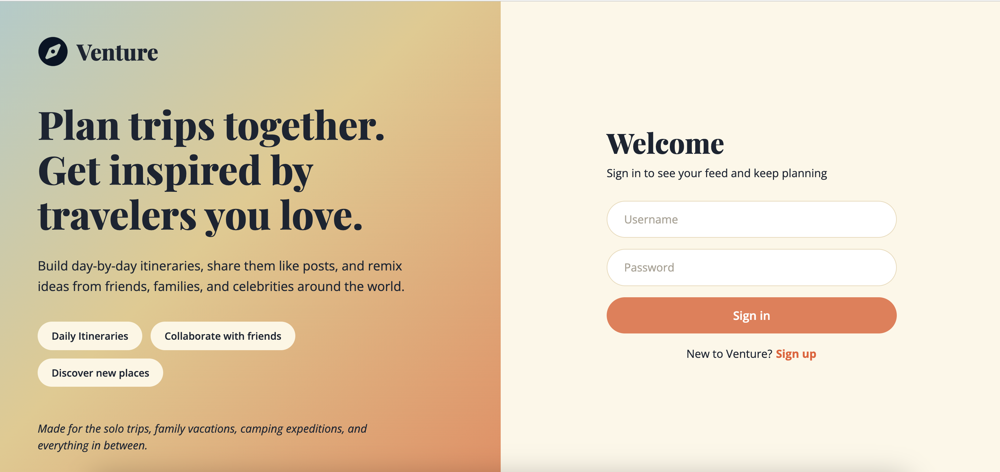
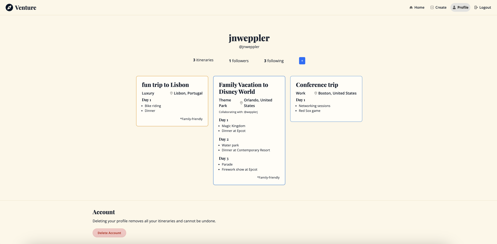
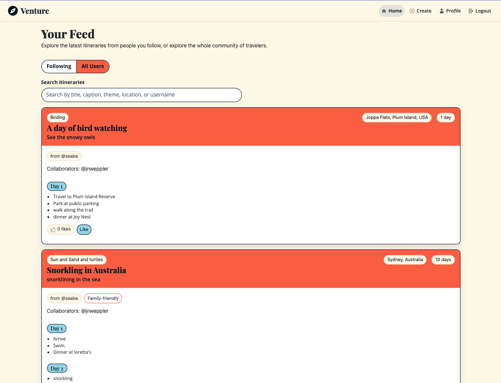
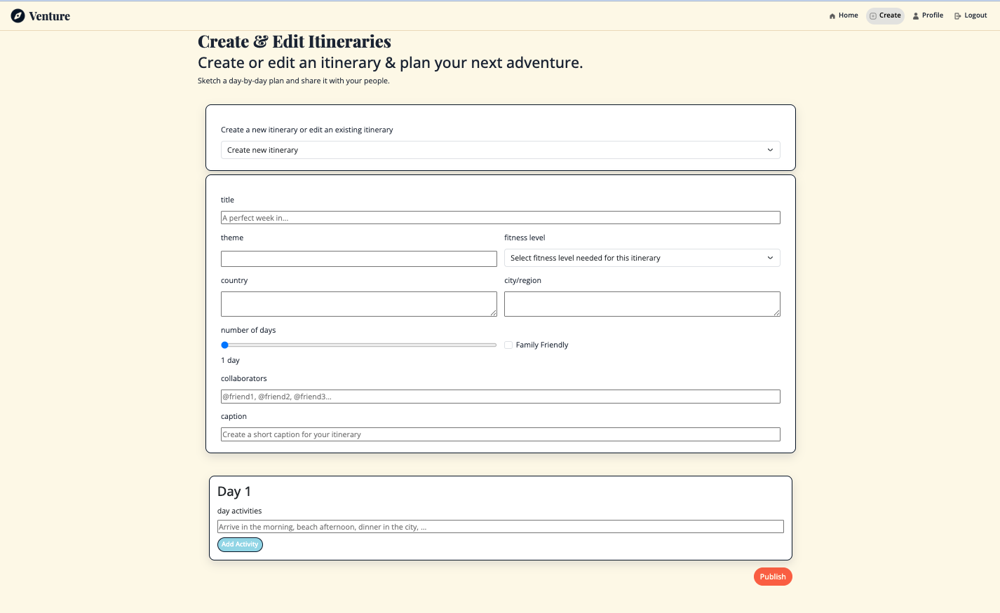

# Venture

A social media application for sharing vacation plans and ideas.

---

## Project Objective

Venture is a social travel-planning application where users can:

- Create day-by-day trip itineraries and share them like posts
- Browse a feed of itineraries for inspiration
- Follow other travelers and manage their followers
- Maintain a profile showing their own itineraries and social stats

The goal is to combine a client-side rendered React frontend (with hooks)
with a Node.js/Express backend, session-based authentication using Passport,
and persistent storage in MongoDB — all served from a single Express server
in production.


---

## Screenshots / Demo

Below are screenshots of each page of the website.

### [Login Page](https://venture-3ojg.onrender.com)



### Profile Page



### Home Feed Page



### Create & Edit Page



# Demo Video

[Demo of Venture site](https://youtu.be/RGJaSWaeLGg)

---

## Design

The visual design of this site was planned prior to development, covering layout, color palette, and typography decisions. The design document also includes user personas, division of work, and CRUD explination.

[View Design Plan Narrative Discussion](./design/design.md)

[View Design Graphis](./design/P3_VentureDesign.jpg)

---

### Presentation Slides

[Presentation slides](https://docs.google.com/presentation/d/1TbRHpUG1_WB00ah-TqqzbsnyzBx7bL5xdHrZbtjx1Y4/edit?usp=sharing)
<!-- This is my slide deck, we will need to replace with our's -->
---

## Project Structure Graphic

```
venture/
├── .gitignore
├── package.json
├── server.js
├── config/
│   └── passport.js
├── db/
│   └── ventureDB.js
├── middleware/
│   └── auth.js
├── models/
│   └── users.js
├── routes/
│   ├── auth.js
│   └── profile.js
└── frontend/
    ├── index.html
    ├── package.json
    ├── vite.config.js
    ├── public/
    │   ├── compass.png
    │   ├── create.png
    │   ├── favicon-16x16.png
    │   ├── home.png
    │   ├── location.png
    │   ├── logout.png
    │   ├── profile.png
    │   └── venture-logo.png
    └── src/
        ├── main.jsx
        ├── components/
        │   ├── FollowModal.jsx
        │   └── NavigationBar.jsx
        ├── css/
        │   ├── CreatePage.css
        │   ├── FollowModal.css
        │   ├── LoginPage.css
        │   ├── Navbar.css
        │   └── ProfilePage.css
        └── pages/
            ├── CreatePage.jsx
            ├── FeedPage.jsx
            ├── LoginPage.jsx
            └── ProfilePage.jsx
```

## Tech Requirements

### Tech Stack

- React 18 (hooks) + Vite
- React Bootstrap / Bootstrap 5
- React Router
- Node.js
- Express.js
- Passport (local strategy) + express-session
- MongoDB Atlas (native driver)

### Packages

Backend (root `package.json`):

- express
- express-session
- passport, passport-local
- bcrypt
- mongodb
- dotenv
- eslint + prettier (development)

Frontend (`frontend/package.json`):

- react, react-dom
- react-router
- react-bootstrap, bootstrap
- prop-types
- vite, @vitejs/plugin-react (development)
- eslint + prettier (development)

### Local Requirements

- Node.js 20+ and npm 9+ recommended
- MongoDB Atlas credentials configured via environment variables:
  - MONGOUSER
  - MONGOPASS
  - CONNECTION_STRING
  - SESSION_SECRET

## Getting Started

### Prerequisites

- Node.js 18+ and npm 9+
- [Docker](https://docs.docker.com/get-docker/) (for running MongoDB locally)

### 1. Install dependencies (backend and frontend)
```
npm install
cd frontend && npm install && cd ..
```

### 2. Create your environment variables

Create a `.env` file in the project root (never commit this file):

```env
MONGOUSER=your_mongo_username
MONGOPASS=your_mongo_password
CONNECTION_STRING=your_cluster_host
SESSION_SECRET=a_long_random_string
```

### 3. Run in development (two terminals)

Terminal 1 — backend API on port 3300:

```
npm start
```

Terminal 2 — Vite dev server with hot reload (proxies /api to the backend):

```
cd frontend
npm run build
```

## Database Setup

These steps assume you have a local MongoDB running (see the Docker instructions above) and that `mongosh` and the MongoDB Database Tools (`mongoimport`) are installed.

### 1. Create the database and collections

Open a Mongo shell and create the two collections:

```
use venture

db.createCollection("user_profiles")
db.createCollection("itineraries")
```

### 2. Generate a mock data set using mockaroo

Each itineraries document should have the following fields:
```
_id
caption: string
theme: string
country: string
city: string
num_days: int
num_people: int
fitness_level: int
family_friendly: boolean
plan: Object
creator: string
likes: int
collaborators: Array
```

Each user_profiles document should have the following fields:
```
_id
username: string
password: hashed password
email: string
followers: Array
following: Array
```

### 3. Import the CSV into the `prompts` collection

Use `mongoimport` to load the data:

```
mongoimport \
  --uri <connection_uri> \
  --collection prompts \
  --type csv \
  --headerline \
  --file {filename}.csv
```

## Authors

- Julia Weppler [Github](https://github.com/julia-weppler-1) | [Homepage](https://julia-weppler-1.github.io/cs5610-project1-homepage/)
- Carey Barry [Github](https://github.com/clbarry) | [Homepage](https://careybarry.netlify.app/)

## Class Reference

This project was developed in connection with the course:

- [Web Development Online Summer 2026](https://johnguerra.co/classes/webDevelopment_online_summer_2026/)

## Deployment

This project is deployed on Render.

Link: (https://venture-p3.onrender.com)


Deployment note:

- Configure `MONGOUSER`, `MONGOPASS`, `SESSION_SECRET`, and `PORT` in the Render service environment variables.
- Use the start command `npm start` (which runs `node backend.js`).

## AI Disclosure

This project may include AI-assisted development.

- AI tools were used for brainstorming, code review support, and documentation drafting.
- All final code decisions, testing, and integration were reviewed by the project authors.
- Any AI-generated content was validated and adapted to project requirements.

[See AI Discolosure log for details](./AI_Disclosure.md).

## License

Licensed under the MIT License. See `LICENSE` for details.
