# Venture

A social media application for sharing vacation plans and ideas.

---

## Project Objective

Venture is a social travel-planning application where users can:

- Create day-by-day trip itineraries and share them like posts
- Browse a feed of itineraries for inspiration
- Follow other travelers and manage their followers
- Maintain a profile showing their own itineraries and social stats

The goal is to combine a client-side rendered React frontend (with hooks)
with a Node.js/Express backend, session-based authentication using Passport,
and persistent storage in MongoDB — all served from a single Express server
in production.

---

## Screenshots / Demo

Below are screenshots of each page of the website.

### [Login Page](https://venture-1.onrender.com/)

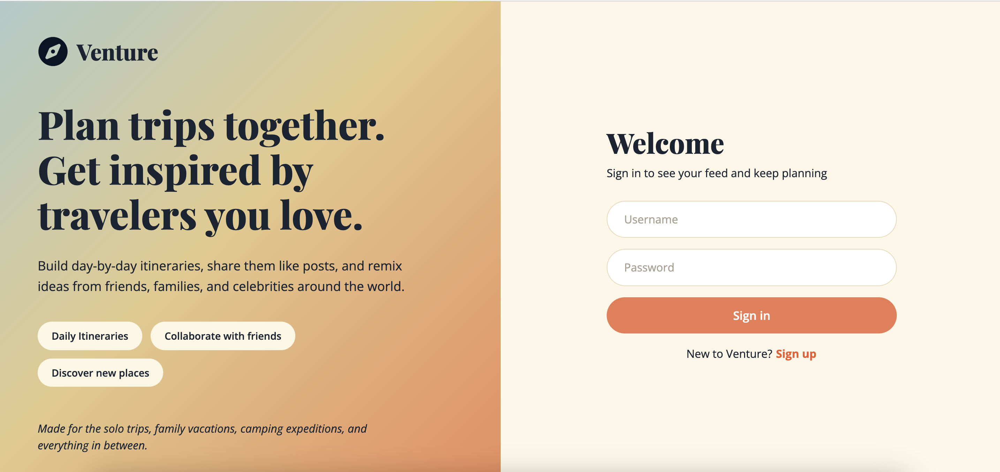

### Profile Page

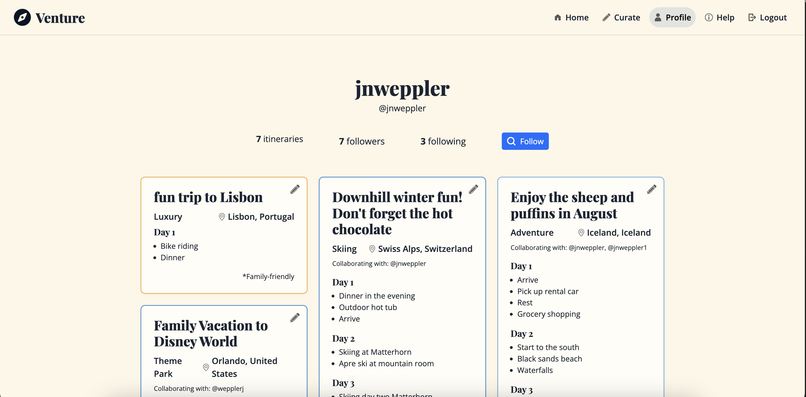

### Home Feed Page

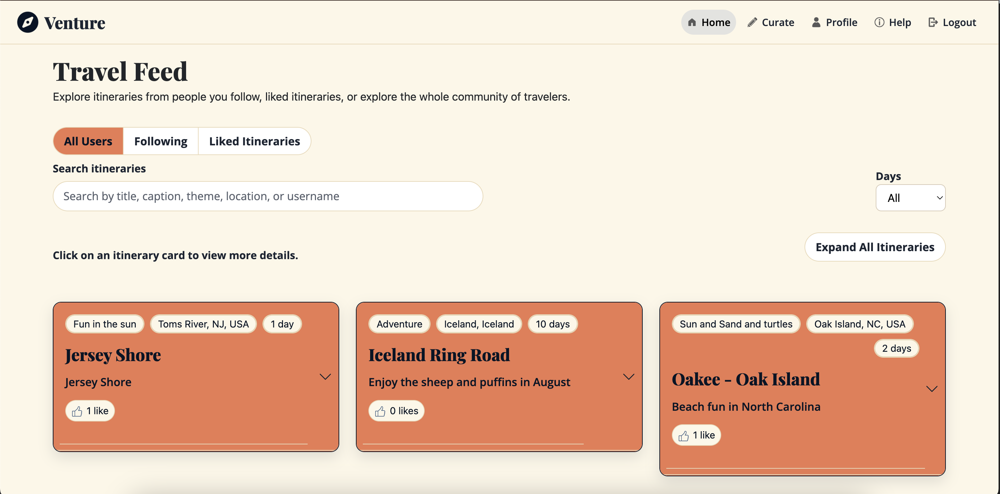

### Create & Edit (Curate) Page

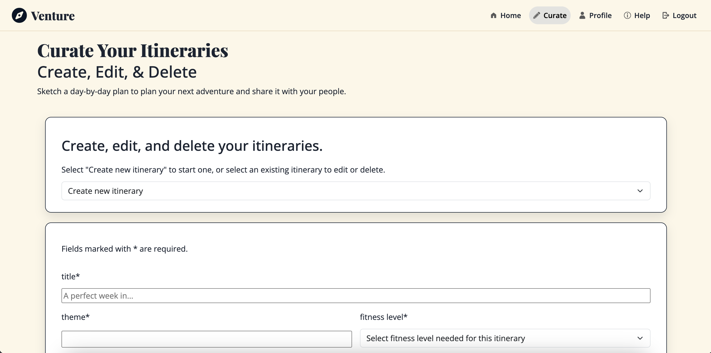

### Help Page

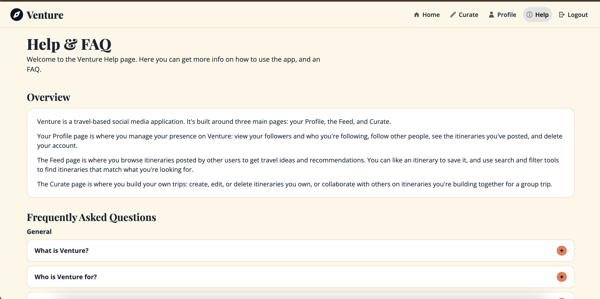

# Demo Video

[Demo of Venture site](youtube.com/watch?si=7bC4RHDU1Ob_j8P_&v=Do49MqIdPk8&feature=youtu.be)

---

## Division of Work

Each project member conducted 3 user interviews and contributed to the development of the interview script and exit survey. After compiling notes, the project members divided the identified tasks accordingly:

- Carey:
  - Navbar language updated to say Curate and pencil icon added.
  - Language on the create page was updated to make it more prominent that users can create, edit, and delete. Brief instructions were added to the form selection.
  - Added filter for liked itineraries option on the feed page for user to view.
  - Debug following feature: following filter tested, accurately showing itineraries from followed users and if they are listed as a collaborator on an itinerary.
  - Users frustrated that you could not order the activities in a day. Added move up and down options for each activity in the array using indexing. Up decreases the index and down increases the index.
  - Itinerary activities details: users wanted more details about the itinerary activities. Added a travel tips text entry option at the itinerary level to allow for more details in the create form. Travel tips added to the itinerary cards for users to view.
  - Add activities and tips to the categories searched in the search bar.
  - Added an * to all required fields with a message indicating all fields with a * are required.
  - It was not clear to users if they needed to select Add Activities to start adding or to save them. Updated language on the create page to make it clearer how to begin each action.
  - Feed page scrolling: The feed page was reorganized using Bootstrap grid to show 3 itinerary cards per row. React Bootstrap accordion feature was added to minimize the card body for easier viewing. An expand all and collapse all button was added. React Bootstrap Pagination component was added for better page navigation; the random loading was removed for consistency.
  - Collaboration feature not clear: Added verbiage indicating collaborators can edit, but not delete itineraries in the create page form. Tested access to collaborate feature; successfully able to collaborate.
  - Modified color palette for consistency of action buttons and accessibility.

- Julia:
  - Add a pencil icon to the itinerary on the profile page that redirects to the edit page.
  - Debug like feature, prevented page refresh and fetch call after liking an itinerary.
  - Identified issue with multiple accounts with the same username. Database enforces that no one can do this now.
  - The last username entered was retained in the search, which caused initial confusion in using the search for users. Cleared state after user closes modals.
  - It was unclear whether the "@" sign is needed to search for users or to add collaborators. Used regex in combination with the autocomplete/search feature so that it does not matter if the user types with @ for the username. It will work both ways.
  - Follow users feature: users were confused about how to follow another user/creator. Added the word ‘follow’ to the search button preceded by a magnifying glass icon.
  - Search and filter (multilevel): Added filter for number of days.
  - Users wanted to be redirected to the profile page after creating an itinerary. Added a pop-up modal, consistent with delete, to confirm success of publishing. Upon clicking close, the user is redirected to profile.
  - Help button: Added a ‘Help’ page with FAQs generated by prompting Claude Sonnet 5, as noted in the AI Disclosure in the GitHub repository.
  - Users wanted suggestions/autocompletion for adding collaborators to their itineraries. Added clickable auto-complete suggestions to user searches. Add valid usernames to input bar as a pill, where ‘x’ can be used to remove. System does not add non-existing usernames to ‘collaborators’. Does not matter if user types with ‘@’ before username.
  - Collaboration feature not clear: Add collaborated itineraries to the user profile view.
  - Delete itinerary confirmation: there was no confirmation shown after deleting an itinerary, causing user confusion. Message was not clear to users, so a modal was added. Redirected to profile upon closing modal.
  - Modified color palette for consistency of action buttons and accessibility.

After incorporating user feedback, both members assessed their work with Axe Devtools Chrome extension and implemented keyboard navigation to their respective pages.

## Design and Accessability

The visual design of this site was planned prior to development, covering layout, color palette, and typography decisions. The design document also includes user personas, division of work, and CRUD explination.

[View Design Plan Narrative Discussion](./design/design.md)

[View Original Design Graphis](./design/P3_VentureDesign.jpg)

On our second iteration, we made some slight redesigns based off of user study evaluations and accessibility considerations. See screenshots and demo above for the visuals of the newest iteration of Venture.

#### Accessibility

**Colorblindness**

Login Page

<p align="center">
  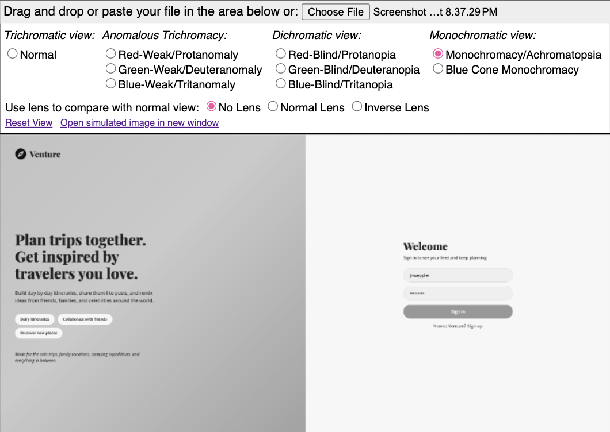
  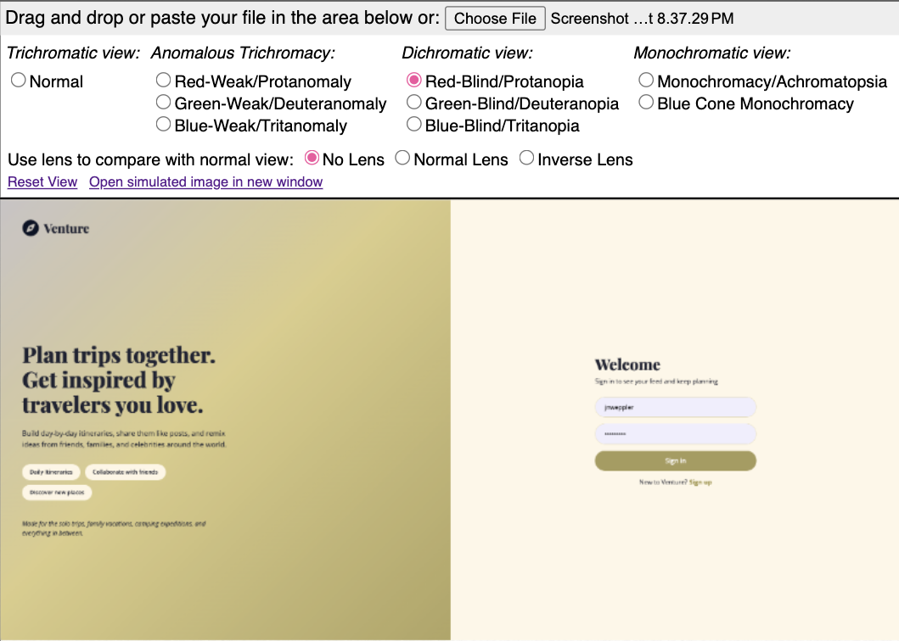
  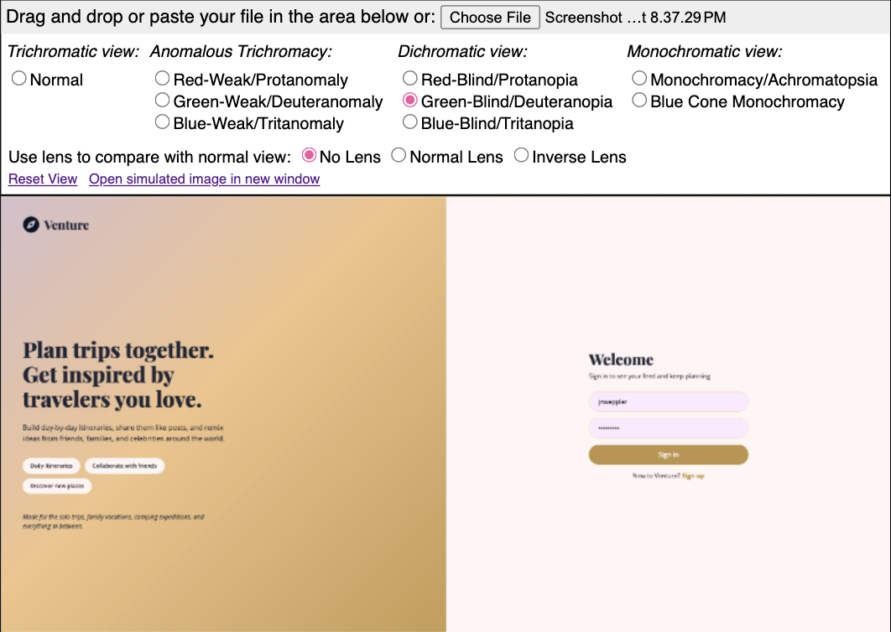
</p>

Profile Page

<p align="center">
  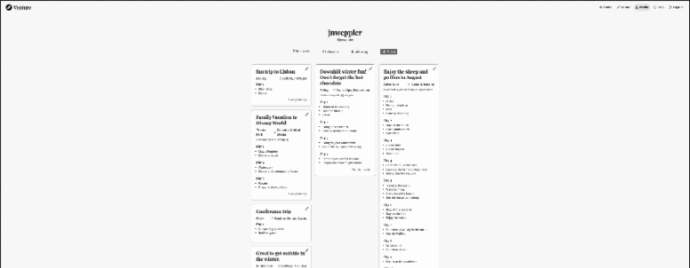
  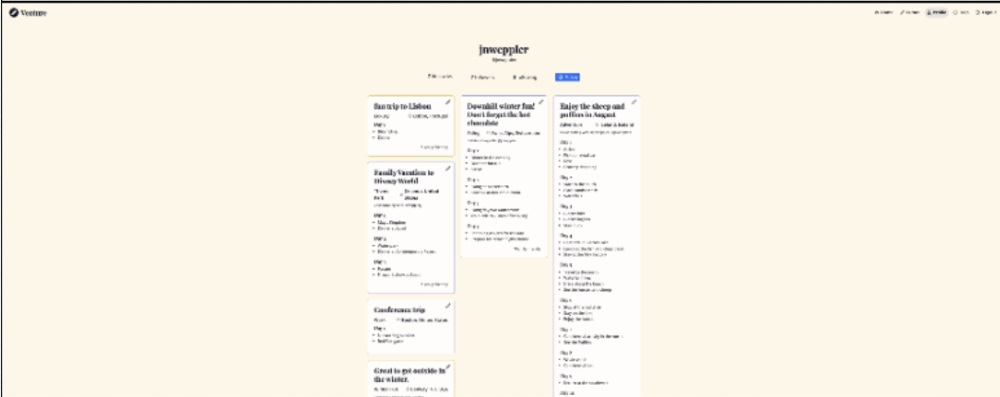
  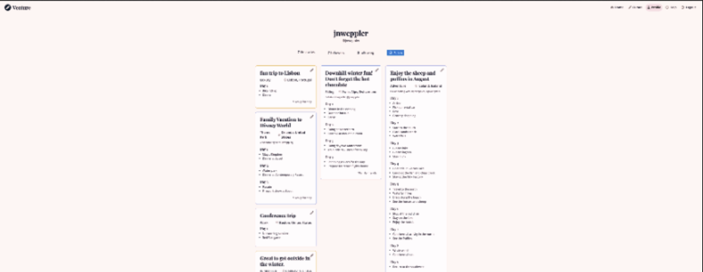
</p>

Home Feed Page

<p align="center">
  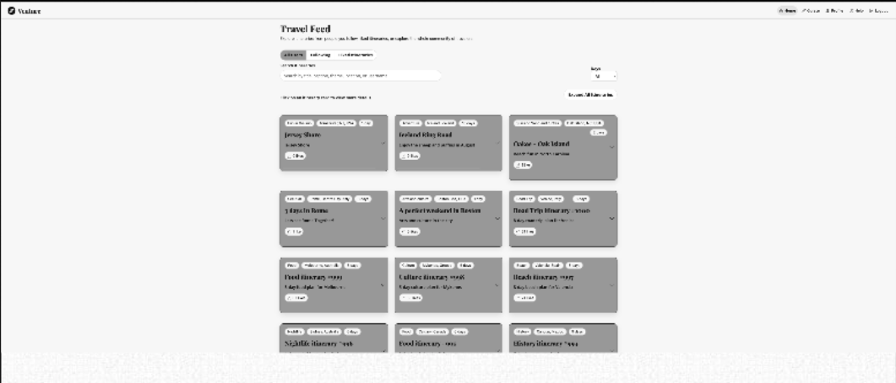
  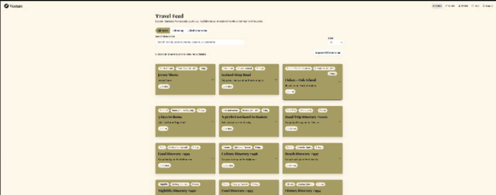
  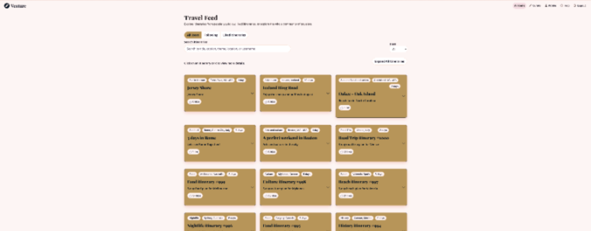
</p>

Create & Edit (Curate) Page

<p align="center">
  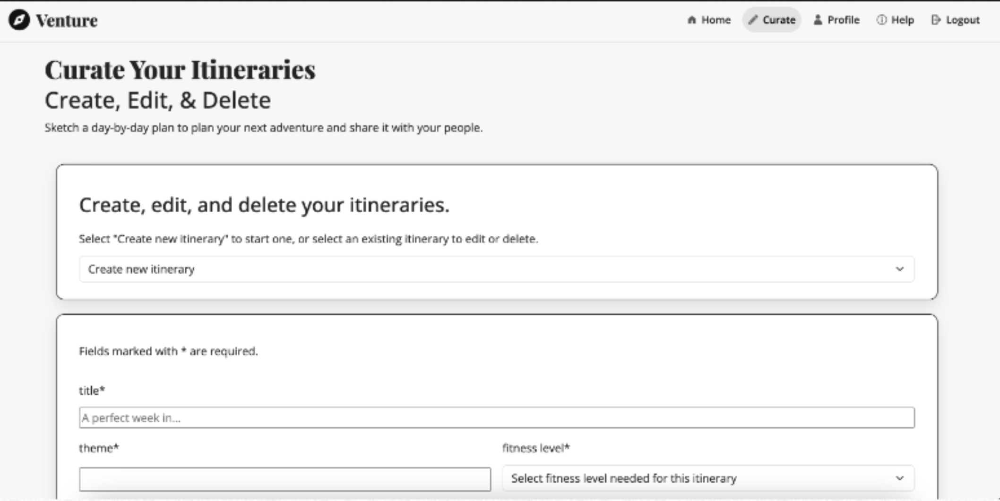
  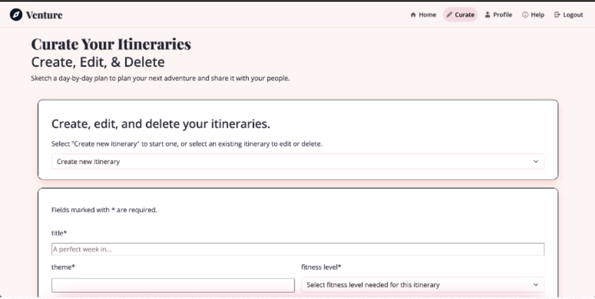
  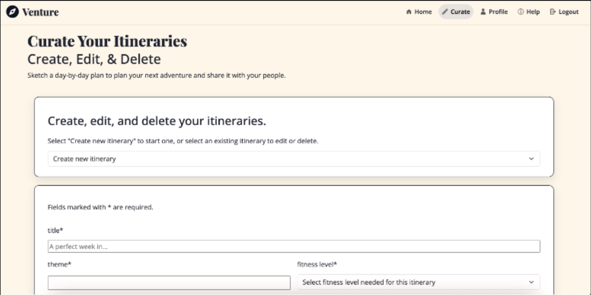
</p>

Help Page

<p align="center">
  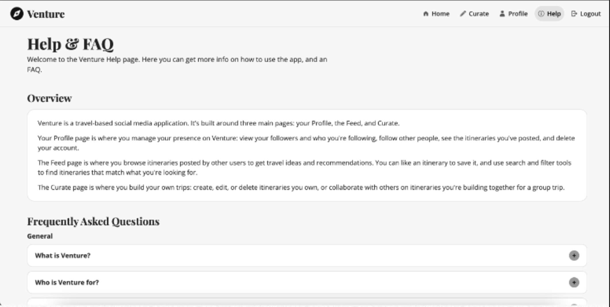
  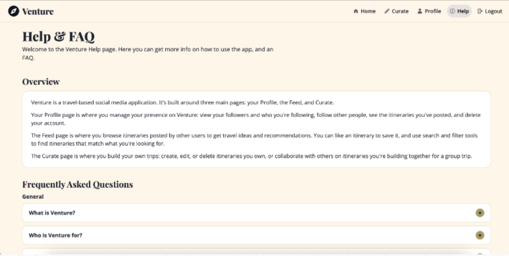
  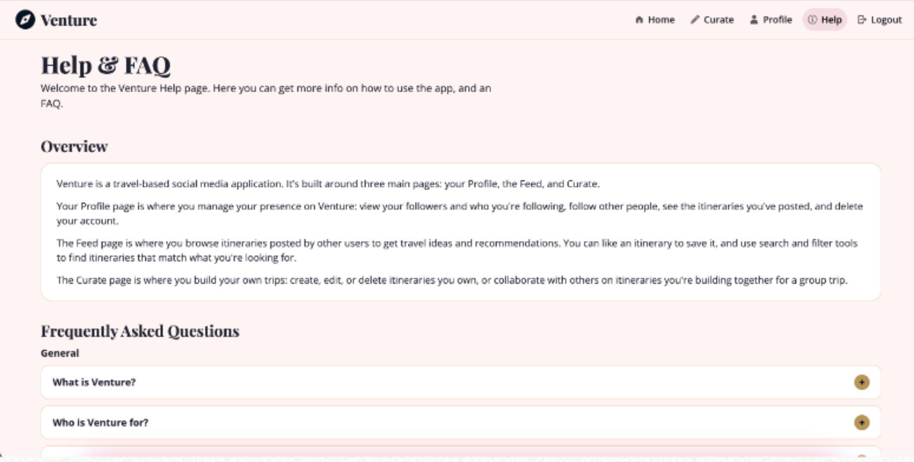
</p>

**Text & Font**

Playfair and Open Sans were used in this application through Google Fonts. These fonts were chosen based on their aesthetic appeal to the designers and their pairing in https://fontpair.co/fonts/google/playfair-display.
The combination offers an element of sophistcation paired with a more fun and casual font to fit the vibe of our site.

**Axe Devtools**

The Axe Devtools Chrome extension was used to scan each webpage for issues related to readability and accessibility. Originally, minor contrast issues related to button colors were detected and fixed by darkening the colors until an acceptable ratio was reached. Keyboard navigability on the Feed page also raised initial issues and were addressed by carefully managing the focus() between nested components.

Venture now raises 0 issues with the Axe Devtools scan across each of its pages and components.

# Demo Video

https://www.youtube.com/watch?v=V0lADEM26cU

---

### Presentation Slides

[Slide deck](https://docs.google.com/presentation/d/1plv3NFVBxk6XM4kuj8bBjOcRRqjMb4mRNnGVsGOyzBw/edit?usp=sharing)
---

## Project Structure Graphic

```
venture/
├── .gitignore
├── package.json
├── server.js
├── config/
│   └── passport.js
├── db/
│   └── ventureDB.js
├── middleware/
│   └── auth.js
├── models/
│   └── users.js
├── routes/
│   ├── auth.js
│   └── profile.js
└── frontend/
    ├── index.html
    ├── package.json
    ├── vite.config.js
    ├── public/
    │   ├── compass.png
    │   ├── create.png
    │   ├── favicon-16x16.png
    │   ├── home.png
    │   ├── location.png
    │   ├── logout.png
    │   ├── profile.png
    │   └── venture-logo.png
    └── src/
        ├── main.jsx
        ├── components/
        │   ├── FollowModal.jsx
        │   ├── DayPlans.jsx
        │   ├── FeedCards.jsx
        │   └── NavigationBar.jsx
        ├── css/
        │   ├── CreatePage.css
        │   ├── FollowModal.css
        │   ├── DayPlans.css
        │   ├── FeedPage.css
        │   ├── HelpPage.css
        │   ├── LoginPage.css
        │   ├── Navbar.css
        │   └── ProfilePage.css
        └── pages/
            ├── CreatePage.jsx
            ├── FeedPage.jsx
            ├── HelpPage.jsx
            ├── LoginPage.jsx
            └── ProfilePage.jsx
```

## Tech Requirements

### Tech Stack

- React 18 (hooks) + Vite
- React Bootstrap / Bootstrap 5
- React Router
- Node.js
- Express.js
- Passport (local strategy) + express-session
- MongoDB Atlas (native driver)

### Packages

Backend (root `package.json`):

- express
- express-session
- passport, passport-local
- bcrypt
- mongodb
- dotenv
- eslint + prettier (development)

Frontend (`frontend/package.json`):

- react, react-dom
- react-router
- react-bootstrap, bootstrap
- prop-types
- vite, @vitejs/plugin-react (development)
- eslint + prettier (development)

### Local Requirements

- Node.js 20+ and npm 9+ recommended
- MongoDB Atlas credentials configured via environment variables:
  - MONGOUSER
  - MONGOPASS
  - CONNECTION_STRING
  - SESSION_SECRET

## Getting Started

### Prerequisites

- Node.js 18+ and npm 9+
- [Docker](https://docs.docker.com/get-docker/) (for running MongoDB locally)

### 1. Install dependencies (backend and frontend)

```
npm install
cd frontend && npm install && cd ..
```

### 2. Create your environment variables

Create a `.env` file in the project root (never commit this file):

```env
MONGOUSER=your_mongo_username
MONGOPASS=your_mongo_password
CONNECTION_STRING=your_cluster_host
SESSION_SECRET=a_long_random_string
```

### 3. Run in development (two terminals)

Terminal 1 — backend API on port 3300:

```
npm start
```

Terminal 2 — Vite dev server with hot reload (proxies /api to the backend):

```
cd frontend
npm run build
```

## Database Setup

These steps assume you have a local MongoDB running (see the Docker instructions above) and that `mongosh` and the MongoDB Database Tools (`mongoimport`) are installed.

### 1. Create the database and collections

Open a Mongo shell and create the two collections:

```
use venture

db.createCollection("user_profiles")
db.createCollection("itineraries")
```

### 2. Generate a mock data set using mockaroo

Each `itineraries` document currently uses the following shape:

```
_id: ObjectId
title: string
caption: string
theme: string
fitness_level: string
country: string
city: string
collaborators: string[]
family_friendly: boolean
day_count: number
tips: string
plan: {
  day_1: string[]
  day_2: string[]
  ...
}
creator: string
likes: number
liked_by: string[]
```

Note: the feed also returns a derived `liked: boolean` value for the current
signed-in user, but that field is computed in the API and is not stored in the
database.

Each user_profiles document should have the following fields:

```
_id
username: string
password: hashed password
email: string
followers: Array
following: Array
```

### 3. Import the CSV into the `itineraries` collection

Use `mongoimport` to load the data:

```
mongoimport \
  --uri <connection_uri> \
  --collection itineraries \
  --type csv \
  --headerline \
  --file {filename}.csv
```

## Authors

- Julia Weppler [Github](https://github.com/julia-weppler-1) | [Homepage](https://julia-weppler-1.github.io/cs5610-project1-homepage/)
- Carey Barry [Github](https://github.com/clbarry) | [Homepage](https://careybarry.netlify.app/)

## Class Reference

This project was developed in connection with the course:

- [Web Development Online Summer 2026](https://johnguerra.co/classes/webDevelopment_online_summer_2026/)

## Deployment

This project is deployed on Render.

Link: (https://venture-1.onrender.com/)

Deployment note:

- Configure `MONGOUSER`, `MONGOPASS`, `SESSION_SECRET`, and `PORT` in the Render service environment variables.
- Use the start command `npm start` (which runs `node backend.js`).

## AI Disclosure

This project may include AI-assisted development.

- AI tools were used for brainstorming, code review support, and documentation drafting.
- All final code decisions, testing, and integration were reviewed by the project authors.
- Any AI-generated content was validated and adapted to project requirements.

[See AI Discolosure log for details](./AI_Disclosure_p4.md).

## License

Licensed under the MIT License. See `LICENSE` for details.
